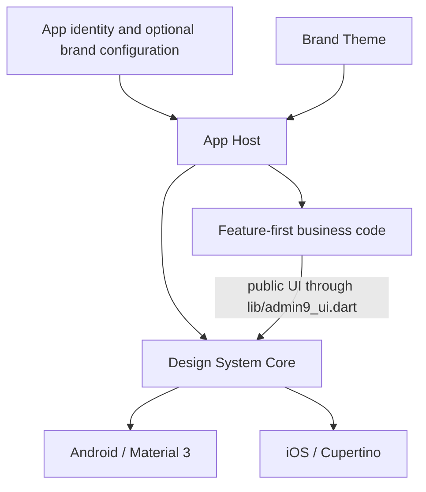

# Admin9 App Starter

English | [简体中文](docs/zh-CN/README.md)

Admin9 App Starter is an open-source Flutter starting point for Android and
iOS applications. It provides a feature-first app host, platform adaptation,
accessibility behavior, a reusable Design System, quality gates, and optional
identity and brand tooling. It is not a finished business product, a backend,
an admin console, or a compatibility program for other projects.

## What Is Included

- Flutter startup, global error handling, Provider composition, and explicit
  routes.
- A fail-closed, persisted privacy-consent gate.
- Home and Account navigation, settings, legal-document hosts, About, and
  Contact pages.
- Honest guest and unavailable-service states. The Starter does not fabricate
  users, sessions, tokens, messages, or successful backend operations.
- Material 3 and Cupertino mapping through public `App*` components.
- Appearance and accessibility settings, responsive matrices, semantics,
  contrast, hit-target, Gallery, Golden, and platform checks.
- An optional App configuration tool for synchronizing identity, colors, app
  icons, launch images, Android display data, and iOS display data.

The repository currently has no real backend or authentication-success path.
Repository, Service, or Domain layers should be added inside a feature only
when a real data source or reusable domain rule gives them a concrete job.

## Architecture



Core, Brand, Business, and App Host are repository ownership and dependency
boundaries. They are not mandatory UI/Data/Domain runtime layers. Current
upstream contributions follow these boundaries so the shared code remains
testable; forks may change their own architecture independently.

```text
lib/
├── main.dart                 # Flutter initialization and error capture
├── admin9_ui.dart            # Design System public barrel
├── app/                      # App Host, routes, privacy gate, identity, Brand
├── core/                     # Design System, errors, and local preferences
└── ui/
    ├── features/             # feature-first pages, state, and local models
    └── shared/               # UI shared by features in this repository
```

See the [current architecture](docs/architecture/admin9-app-starter.md) and
[Design System](docs/design-system/README.md) for the upstream implementation
rules.

## Forks And Independent Use

You may copy, modify, use commercially, and redistribute the code under the
[Apache License 2.0](LICENSE). A fork is fully independent:

- this project does not certify, approve, register, track, or audit forks;
- there is no required manifest, compatibility registry, source commit tuple,
  remote name, push restriction, ownership record, deviation record, expiry,
  provenance record, or clone-acceptance process;
- this project does not promise compatibility, support, migrations, security
  maintenance, compliance review, delivery, or release assistance for forks;
- fork maintainers are responsible for their own maintenance, security,
  privacy, legal compliance, dependency review, testing, signing, delivery,
  and user support; and
- fixes do not have to be contributed back upstream. Contributions are welcome
  only when their authors choose to propose them.

The Apache License applies to the software copyright and patent grants. It does
not grant a right to present a product as endorsed, certified, or officially
compatible by Admin9, nor a general right to use the Admin9 name or Logo as a
fork's product identity. See [Trademark Notice](TRADEMARKS.md). Dependencies,
fonts, images, and other third-party materials remain subject to their own
licenses and notices. For example, the test font license is preserved at
`test/assets/fonts/OFL.txt`.

## Optional App And Brand Configuration

No configuration file is required to use or fork this repository. The optional
JSON-compatible YAML schema and example can reduce repetitive identity work:

```bash
dart run tool/design_system/validate_app_config.dart --fixtures
dart run tool/design_system/validate_app_config.dart path/to/app-config.yaml
dart run tool/design_system/apply_app_config.dart path/to/app-config.yaml .
dart run tool/design_system/verify_app_config.dart path/to/app-config.yaml .
```

The tool synchronizes the configured app name and version, Dart identity,
`pubspec.yaml` description and assets, Android namespace/application ID/display
name/Kotlin package/icons/launch image, and iOS bundle/display names/icons/launch
images. Changing application or bundle identifiers affects installation,
signing, and upgrades; it is opt-in and is not part of this repository's
Foundation-to-Starter rename. The default identifiers remain
`com.admin9.app.foundation` for continuity.

See the [customization quickstart](docs/customization/quickstart.md). The tool is
a convenience, not proof of compatibility or approval.

## Upstream Verification

Run from the repository root with Flutter 3.44.1 and Dart 3.12.1:

```bash
flutter pub get
dart format --output=none --set-exit-if-changed lib test integration_test tool
flutter analyze
flutter test
dart run tool/design_system/validate_app_config.dart --fixtures
flutter analyze tool/design_system/design_system_contract_probe.dart
flutter analyze tool/design_system/design_system_implementation_probe.dart
dart run tool/design_system/verify_public_api_parity.dart --self-test
dart run tool/design_system/verify_import_boundaries.dart --fixtures
dart run tool/design_system/verify_import_boundaries.dart --phase=final
dart run tool/design_system/verify_ui_candidate_boundary.dart --fixtures
dart run tool/design_system/verify_ui_candidate_boundary.dart
dart run tool/design_system/verify_gallery_boundary.dart
dart run tool/design_system/verify_app_config.dart
dart run tool/design_system/verify_app_config.dart --fixtures
dart run tool/design_system/verify_rule_links.dart
dart run tool/design_system/verify_upstream_ownership.dart
dart run tool/design_system/verify_android_release_plugins.dart --self-test
dart run tool/design_system/verify_android_release_plugins.dart
node tool/design_system/verify_documentation.mjs
flutter build apk --release
flutter build ios --release --no-codesign
git diff --check
```

An unsigned iOS build does not prove signing, installation, cold launch, or
device behavior. Device and assistive-technology claims require evidence tied
to the tested source and artifact.

## Versions And History

- App version: `1.0.0+1`.
- Current recorded Design System release: `1.0.3`.
- Toolchain: Flutter `3.44.1` / Dart `3.12.1`.
- Existing `design-system-v1.0.0` through `design-system-v1.0.3` tags and prior
  reports are immutable historical records. Their former Foundation and
  downstream-governance wording does not define the current Starter project.
- New changes follow SemVer and are recorded under `Unreleased` before a
  release. Existing tags are never moved or recreated.

## Documentation

- [Design System](docs/design-system/README.md)
- [Accessibility and Quality](docs/design-system/06-accessibility-quality.md)
- [Current architecture](docs/architecture/admin9-app-starter.md)
- [Optional customization quickstart](docs/customization/quickstart.md)
- [Upstream contribution boundaries](docs/design-system/05-upstream-contribution-boundaries.md)
- [Validation](docs/audit/VALIDATION.md)
- [Historical records](docs/HISTORY.md)
- [Changelog](docs/design-system/CHANGELOG.md)
- [Contributing](CONTRIBUTING.md)
- [Trademark Notice](TRADEMARKS.md)
- [License](LICENSE)
