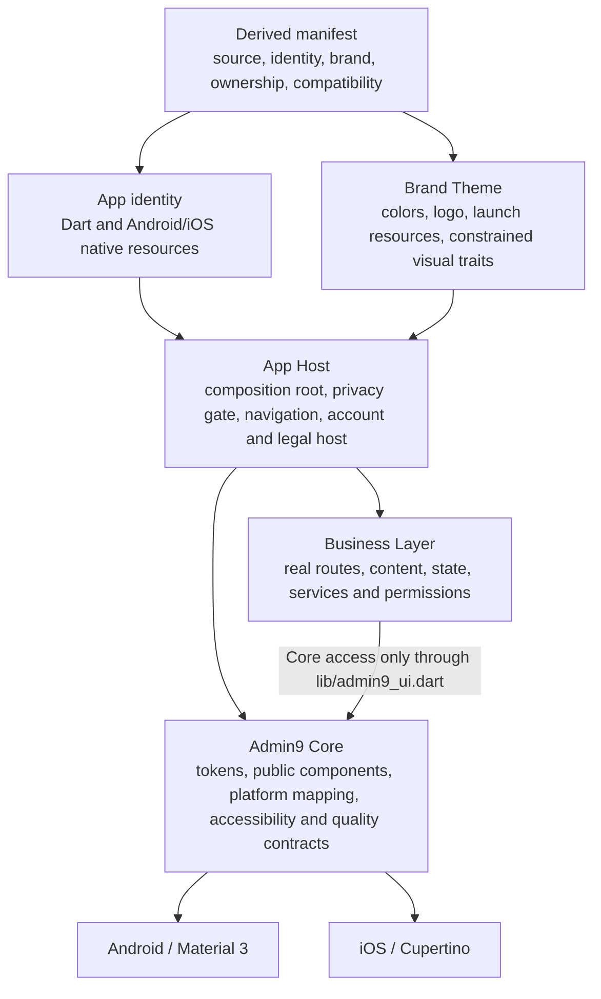

# Admin9 App Foundation

English | [简体中文](docs/zh-CN/README.md)

A derivable engineering baseline for Android and iOS Flutter business apps. It centralizes platform adaptation, accessibility, brand identity, the common app host, and upgrade governance. It is not a finished app, an admin template, a component demo, or a standalone UI package.

## Why Adopt It

The Foundation owns engineering responsibilities that would otherwise be repeated across business apps and scattered through their features:

- **Constrained platform adaptation:** public `App*` components map Material 3 and Cupertino behavior inside Core. Business code does not select platform widgets or implement platform branches. See [Platform Adaptation (Chinese)](docs/design-system/02-platform-adaptation.md).
- **Consistent accessibility state:** system and app text scales are multiplied, while high contrast, reduce motion, Bold Text, and grayscale follow defined merge rules. Layout matrices, semantics, contrast, and device evidence gates constrain the result. See [Accessibility and Quality (Chinese)](docs/design-system/06-accessibility-quality.md).
- **No fabricated business success:** the privacy gate, primary navigation, account boundary, settings, and legal host are present. Until real services exist, authentication and sensitive actions perform local validation and show an explicit unavailable state; they do not create fake users, tokens, or success results.
- **One source for brand and identity:** a derived project's root `admin9-foundation.yaml` drives Dart Brand data, app identity, Android/iOS identifiers, and native resources. Validators check the schema, hashes, color contrast, and iOS icon properties. See the [Derived-Project Contract (Chinese)](docs/design-system/05-derived-project-contract.md).
- **Machine-enforced public boundaries:** the fixed barrel, import rules, constructor parity, Gallery, Goldens, manifest, documentation, and release consistency all have repository gates.
- **Traceable upgrades:** Design System, Foundation Git source, app, and customer business versions remain distinct. Derived projects record the exact commit, compatibility tuple, deviations, owners, and expiry conditions.
- **Complexity follows real responsibility:** there is no real data source today, so the Foundation does not create empty Repository, Service, or Domain layers. A Business Feature adds them only when it owns the corresponding responsibility.

## Fit

Use this Foundation when:

- a team maintains one or more branded Android/iOS apps over time;
- platform behavior, accessibility, brand generation, and engineering gates need a shared baseline;
- customer business code must remain independent while continuing to receive common Foundation fixes.

It is not intended for:

- Web, Desktop, admin consoles, or cross-platform dynamic module systems;
- teams expecting a clone-ready industry app or backend;
- projects that only want a UI package from pub.dev;
- projects that expect the Foundation to prescribe customer data, permission, or remote-page models.

The contracts and tools in this repository prove the derivation mechanism. They do not claim that multiple branded production apps have already validated it.

## Governance And Dependencies

Core, Brand, and Business are ownership and change-governance boundaries, not conventional UI/Data/Domain runtime layers. The App Host composes them and provides startup, the privacy gate, navigation, the account boundary, settings, and legal entry points.



The diagram describes a **derived project**. The Foundation source repository intentionally has no root manifest. Business consumes Core UI only through `lib/admin9_ui.dart`; it may also use its own feature, `lib/ui/shared/`, and the read-only App allowlist entries `lib/app/app_identity.dart` and `lib/app/app_route_names.dart`. The App Host is the composition host, not a fourth customer customization layer.

See the [Design System boundaries (Chinese)](docs/design-system/README.md#2-three-layer-model), [ownership/import contract (Chinese)](docs/design-system/05-derived-project-contract.md#2-ownership-and-imports), and [current architecture (Chinese)](docs/architecture/admin9-app-foundation.md) for the complete rules.

## What Is Included

### App Host

- Flutter startup, a global error boundary, and the Provider composition root;
- a fail-closed, persisted privacy-consent gate on first launch;
- Home and Account primary navigation plus static, auditable secondary routes;
- guest/session boundaries, settings, legal, about, and contact entry points.

### Design System Core

- semantic tokens, themes, and platform mapping;
- rules that merge system and app appearance/accessibility settings;
- public `App*` components, page patterns, interaction feedback, and a debug/profile Gallery;
- a fixed public barrel, import boundaries, constructor parity, responsive matrices, and Goldens.

The [Component Specification (Chinese)](docs/design-system/03-components.md) is the source of truth for the component inventory and state contracts.

### Current Common Pages

The repository currently includes Home, sign-in, registration, password recovery and change entry points, Account, Profile, Security, Account Deletion, Settings, Terms, Privacy Policy, About, and Contact pages. They provide host structure, local validation, and honest unavailable states. They do not provide a backend, real authentication, customer content, or final legal text.

## Current Structure

```text
lib/
├── main.dart                 # Flutter initialization and global error capture
├── admin9_ui.dart            # Core's only public barrel
├── app/                      # App Host, routes, privacy gate, identity and Brand entry
│   └── brand/                # manifest-generated Brand Theme data entry
├── core/
│   ├── design_system/        # Core implementation, components, platform mapping and Gallery
│   ├── errors/               # global error boundary
│   └── preferences/          # local appearance, accessibility and privacy preferences
└── ui/
    ├── features/             # feature-first Business pages, state and local models
    └── shared/               # Business UI shared across features in one derived app
```

There is no independent lifecycle owner. The App Host observes system accessibility feature changes only where they affect the effective appearance state. Routing and Brand belong to `app/`, not Core.

## Deriving An App

A derived project must start from an exact compatibility-registry-approved Foundation tuple and must also verify that the selected checkout contains the root `LICENSE`. Configure the canonical Foundation as a fetch-only remote named `foundation`, keep the customer-writable remote separate, copy the valid manifest fixture, replace it with real identity and brand facts, validate it, generate Dart/native resources, and then add real business features under `lib/ui/features/**`.

There is no manifest initialization command. See the [Derived App Quickstart (Chinese)](docs/derivation/quickstart.md) for executable steps and the [Derived-Project Contract (Chinese)](docs/design-system/05-derived-project-contract.md) plus [compatibility registry](docs/design-system/schema/admin9-foundation-compatibility.json) for normative requirements.

## Proving It Has Not Drifted

The Foundation and derived projects use repository tools to verify the critical boundaries:

| Gate | Evidence scope |
| --- | --- |
| manifest validator | schema, exact compatibility tuple, brand hashes, contrast, deviation expiry |
| Brand generator/verifier | Dart, pubspec, Android/iOS identity, and binary resources derive from one manifest |
| repository governance | canonical remote and a derived project's fetch-only `foundation` remote |
| import boundaries | Core/App/Brand/Business ownership, public barrel, and platform branch boundaries |
| public API parity | declaration/implementation constructor parity and public exports |
| Gallery/Golden/tests | public component states, platform mapping, layout, semantics, and visual baselines |
| documentation/release consistency | rules, versions, schema, fixture, compatibility, and provenance consistency |

Common Foundation checks:

```bash
flutter pub get
dart format --output=none --set-exit-if-changed lib test integration_test tool
flutter analyze
flutter test
dart run tool/design_system/validate_foundation_manifest.dart --fixtures
flutter analyze tool/design_system/design_system_contract_probe.dart
flutter analyze tool/design_system/design_system_implementation_probe.dart
dart run tool/design_system/verify_public_api_parity.dart --self-test
dart run tool/design_system/verify_import_boundaries.dart --fixtures
dart run tool/design_system/verify_import_boundaries.dart --phase=final
dart run tool/design_system/verify_gallery_boundary.dart
dart run tool/design_system/verify_brand_contract.dart
dart run tool/design_system/verify_brand_contract.dart --fixtures
dart run tool/design_system/verify_rule_links.dart
dart run tool/design_system/verify_repository_governance.dart
dart run tool/design_system/verify_android_release_plugins.dart --self-test
dart run tool/design_system/verify_android_release_plugins.dart
node tool/design_system/verify_documentation.mjs
flutter build apk --release
flutter build ios --release --no-codesign
git diff --check
```

A release must also run `verify_design_system_release.dart` with its target version and exact Foundation implementation commit. The README intentionally does not hard-code a future commit. See the [Design System overview (Chinese)](docs/design-system/README.md#6-machine-contracts) for the release sequence.

## Versions And Evidence

| Concept | Current boundary |
| --- | --- |
| Design System | `v1.0.3`; the specification, public component contracts, and quality-gate version recorded by `docs/design-system/README.md` and immutable `design-system-v*` tags |
| Foundation source | the exact implementation commit approved by the compatibility registry; distinct from the provenance commit targeted by a tag |
| Foundation tag | an approved Design System release entry pointing to a separate provenance commit; existing tags must not move or be recreated |
| App version | `1.0.0+1` in `pubspec.yaml`; it does not change automatically with the Design System |
| Toolchain | Flutter `3.44.1` / Dart `3.12.1` |
| Backend and session | no real backend is connected; the runtime remains a guest and has no real authentication-success path |
| Device evidence | the v1.0.2 record is historical evidence tied to its source and artifact; physical-device and assistive-technology results not rerun for later versions remain `Unknown` |
| Generic iOS build | `flutter build ios --release --no-codesign` proves only an unsigned build, not signing, installation, or cold launch |

Do not describe an untagged working-tree version as released before a new tag exists and passes compatibility and release-consistency gates.

The existing `design-system-v1.0.0` through `design-system-v1.0.3` tags do not contain the root `LICENSE` and must remain immutable. Adopters must select a compatibility-registry-approved source whose checkout actually contains `LICENSE`.

## Documentation

- [Design System overview (Chinese)](docs/design-system/README.md)
- [Derived-Project Contract (Chinese)](docs/design-system/05-derived-project-contract.md)
- [Accessibility and Quality (Chinese)](docs/design-system/06-accessibility-quality.md)
- [Current architecture and ownership (Chinese)](docs/architecture/admin9-app-foundation.md)
- [Derived App Quickstart (Chinese)](docs/derivation/quickstart.md)
- [Changelog (Chinese)](docs/design-system/CHANGELOG.md)
- [Contributing](CONTRIBUTING.md)
- [License](LICENSE)
