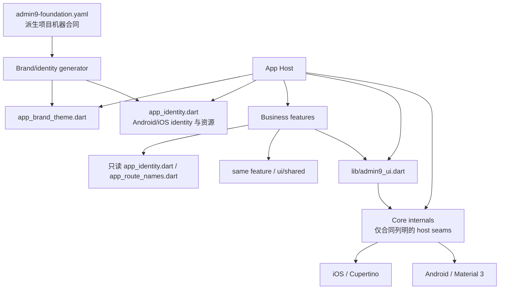

# Admin9 App Foundation Architecture

## 1. Scope

本文描述当前 Foundation 源码的实际 ownership、依赖方向和派生扩展方式。规范性产品语义和质量规则仍由 [Admin9 Design System](../design-system/README.md) 持有，派生仓库必须同时遵守[派生项目合同](../design-system/05-derived-project-contract.md)。

当前架构不是普通的“MVVM 骨架”，而是：

> Core、Brand、Business 三类治理边界 + App Host 组合宿主 + feature-first Business 扩展 + 可验证派生治理。

Core、Brand、Business 描述所有权和允许变化，不等同于 UI/Data/Domain 运行时分层。App Host 负责组合，不是第四类客户业务层。

## 2. Source Structure

```text
lib/
├── main.dart
├── admin9_ui.dart
├── app/
│   ├── admin9_app.dart
│   ├── admin9_shell.dart
│   ├── app_identity.dart
│   ├── app_route_names.dart
│   ├── app_routes.dart
│   ├── privacy_gate.dart
│   └── brand/
│       └── app_brand_theme.dart
├── core/
│   ├── design_system/
│   │   ├── components/
│   │   ├── foundation/
│   │   └── gallery/
│   ├── errors/
│   └── preferences/
└── ui/
    ├── features/
    │   ├── about/
    │   ├── account/
    │   ├── auth/
    │   ├── home/
    │   ├── legal/
    │   └── settings/
    └── shared/
```

旧架构中的 `core/lifecycle/`、`core/navigation/`、`core/branding/`、`core/theme/` 和 `core/widgets/` 不再是有效 ownership。Git 不跟踪空目录；架构只以实际受版本控制的文件为准。

## 3. Ownership

| 路径 | Owner | 当前职责 |
| --- | --- | --- |
| `lib/main.dart` | Foundation/App Host | 初始化 Flutter、全局错误捕获、SharedPreferences 和 App |
| `lib/app/**` | Foundation/App Host | Provider 组合、隐私门禁、导航、路由、App identity 和 Brand 注入 |
| `lib/app/brand/app_brand_theme.dart` | Brand owner，Core review | manifest 生成的唯一 Brand Theme 数据入口 |
| `lib/core/design_system/**` | Core maintainers | Token、公共组件、平台映射、无障碍、交互 presenter、Gallery 和内部机制 |
| `lib/admin9_ui.dart` | Core maintainers | Business 可访问的唯一 Core 公共 barrel |
| `lib/core/errors/**` | Foundation/App Host | 全局 Flutter/异步错误边界 |
| `lib/core/preferences/**` | Foundation/App Host | 外观、辅助设置和隐私同意的本地持久化封装 |
| `lib/ui/features/<feature>/**` | Business feature owner | 页面、ViewModel、局部模型和未来真实服务边界 |
| `lib/ui/shared/**` | Business owner | 同一派生 App 内跨 feature、同责任的共享 UI |

## 4. Dependency Direction



强制规则：

1. Business 访问 Core 只能经过 `lib/admin9_ui.dart`。
2. Business 可访问本 feature、`lib/ui/shared/**`，以及只读 `lib/app/app_identity.dart`、`lib/app/app_route_names.dart`。
3. Business 不能导入其他 `lib/app/**`、Core internal、Brand 入口或其他 feature 实现。
4. Core 不能导入 App、Feature、Business shared、客户内容、ViewModel、Repository、Service 或 Session。
5. `app_routes.dart` 和 `admin9_app.dart` 只使用 Design System 合同明确列出的 Core internal seam；这些 seam 不通过公共 barrel 暴露。
6. Business 不直接选择 Material/Cupertino 交互控件或编写平台分支。

这些规则由 `verify_import_boundaries.dart --phase=final` 和 fixtures 校验，公共导出由 `verify_public_api_parity.dart --self-test` 约束。

## 5. App Host Composition

启动和组合顺序如下：

1. `main.dart` 初始化 Widgets binding，安装 `AppErrorBoundary`，取得 `SharedPreferences`。
2. `Admin9App` 创建 Appearance、Privacy 和 Session controller。
3. App Host 合并系统与 App 外观/无障碍状态，解析 Core 主题，并安装 Feedback、Interaction 和 Design Token scope。
4. `PrivacyGate` 只有在隐私同意成功持久化后才交出 `Admin9Shell`；写入失败保持锁定。
5. `Admin9Shell` 组合“首页、我的”两项一级导航；`AppRouteFactory` 静态装配二级页面。
6. Gallery 通过 debug/profile-only registry seam 暴露，release 不注册该入口。

当前没有独立 lifecycle owner。`Admin9App` 仅为重新解析真实系统无障碍特征而实现 `WidgetsBindingObserver`；这不是通用业务生命周期服务。

## 6. State And Data Boundaries

当前只有三类真实状态：

- `AppPreferences` 持久化 App 外观、辅助设置和隐私同意；
- `AppearanceController`、`PrivacyController` 和页面 ViewModel 管理 UI 状态/命令；
- `SessionController` 表达游客与已认证边界，但产品运行路径不会创建已认证会话。

由于没有真实网络、数据库或其他业务数据源，当前不创建 Repository、API Service、DTO 或 Domain 层。派生项目按以下触发条件扩展：

| 观察到的职责 | 放置位置 |
| --- | --- |
| 单页展示、输入和命令状态 | 当前 Business Feature 的 View/ViewModel |
| 真实远端、本地数据库或平台数据源 | 当前 Business Feature 的 Repository/Service |
| 同一客户、同责任的第二个 Feature 消费者 | `lib/ui/shared/**` 或 Business 内共享数据边界 |
| 复杂、稳定、跨用例复用的业务规则 | Business Domain 层 |
| 跨业务域或跨派生项目的相同通用产品责任 | 提交 Core sharing request，经过 Design System owner 审批 |

相似外观不是进入 Core 的理由，未知未来需求也不是提前建立空层的理由。

## 7. Brand And Derivation

Foundation 源仓库刻意没有根 `admin9-foundation.yaml`。每个派生项目必须创建一个根 manifest，记录：

- 精确 Foundation implementation commit，以及仅在该 commit 本身有 Tag 时记录的 Tag（否则为 `null`）；
- 精确 Design System 版本和 source Tag；
- App 名称/版本、Android application ID、iOS bundle ID；
- Brand 颜色、字体、圆角、Logo/启动资源路径及哈希；
- Flutter/Dart 工具链；
- Core、Brand、Business ownership 和冻结路径；
- compatibility、deviation 和 provenance。

派生仓库先验证 manifest，再由 `generate_brand_entry.dart` 写入 Dart、pubspec 和 Android/iOS identity/资源，最后由 `verify_brand_contract.dart` 只读回验。生成输出不能手改；变更必须回到 manifest 和源资源。

Foundation remote 固定命名为 `foundation`，fetch URL 为 canonical HTTPS 仓库，push URL 为字面量 `DISABLED`；客户可写 remote 独立配置。详细步骤见[派生 Quickstart](../derivation/quickstart.md)。

## 8. Verification And Evidence

自动化负责可确定事实：

- manifest schema、compatibility tuple、哈希、对比度和偏差；
- import/public API/Brand/identity/Gallery/release 插件边界；
- Widget 状态、布局矩阵、语义、焦点、平台映射和 Goldens；
- analyze、tests、Android release、iOS no-codesign 和版本一致性。

人工设备证据负责真实读屏输出、系统手势、真实 IME、安全区、签名安装和冷启动。历史记录只证明其绑定的 source/artifact；新版本未重跑的事实保持 `Unknown`。`--no-codesign` 构建不能替代签名、安装或实体机证据。

## 9. Upgrade Flow

1. 从 compatibility registry 选择一个 `approved` tuple，记录当前派生项目 source。
2. fetch-only `foundation` remote 获取新 Tag/commit，不直接向 Foundation 推送客户业务。
3. 比较 Core、Brand input、公共 barrel、Gallery、tests 和 manifest/schema 变化。
4. 按无障碍/系统要求、平台行为、Core 语义、Brand、Business、偏差的顺序解决冲突。
5. 重新生成 Brand/native identity，并运行全部自动化和所需设备门禁。
6. 记录接受的变化、保留偏差、owner、expiry 和 source SHA。

通用修复以失败测试且不含客户数据的方式回流 Foundation；客户特有能力留在派生项目。既有 `design-system-v*` Tag 不移动、不重打。

当前 Design System 仍为 `v1.0.3`，App 版本仍为 `1.0.0+1`。既有 `design-system-v1.0.0` 至 `design-system-v1.0.3` Tag 不包含根 `LICENSE`，并继续保持不可移动、不可重打；派生时应选择 compatibility registry 批准且 checkout 实际包含 `LICENSE` 的来源。
