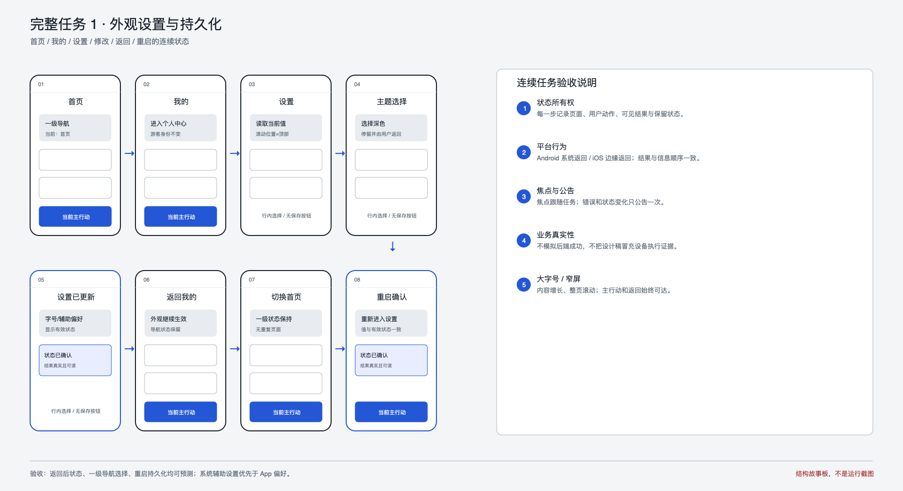
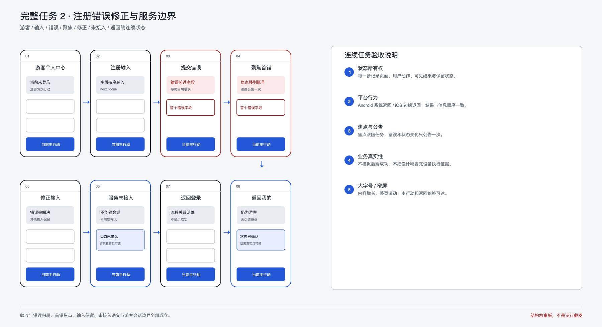

# Admin9 Phase 0C Gate 1 任务故事板

> **历史记录：** 本文保留 Foundation 阶段当时的任务故事板，不是当前 Starter 规范，
> 也不约束任何 fork。

> 状态：结构验收材料，不是运行截图或自动化结果

## 1. 外观设置与持久化

固定任务：

`首页 → 我的 → 设置 → 修改主题与 App 字号 → 修改辅助偏好 → 返回我的 → 切换首页 → 重启 → 回到设置确认持久化`

| 步骤 | 用户动作 | 必须保持的状态 | Gate 1 证据 |
| --- | --- | --- | --- |
| 1-2 | 首页切换到我的 | 一级导航状态可预测；游客身份不改变 | 故事板 01-02 |
| 3 | 进入设置 | 显示当前持久化值 | 故事板 03 |
| 4-5 | 修改外观和辅助偏好 | 即时生效；显示系统+App 合并后的有效状态 | 故事板 04-05 |
| 6-7 | 返回并切换一级页面 | 外观继续生效；不重复创建页面 | 故事板 06-07 |
| 8 | 结束并重启 App | 返回设置后值和有效状态一致 | 故事板 08；实现证据未来补 |

Android 使用系统返回，iOS 使用导航返回/边缘返回预期。重启持久化在当前源码已有基线证据，但本故事板只定义参考设计任务，不把旧截图当新设计通过证据。

逐项状态检查固定如下；每项都必须单独记录，不能用“辅助偏好已更新”代替：

| 设置 | 修改前 | 修改后 | 返回我的后 | 重启后 |
| --- | --- | --- | --- | --- |
| 主题 | 跟随系统 | 深色 | 深色有效 | 深色有效 |
| App 字号 | 标准 | 大号 | 大号有效 | 大号有效 |
| 灰度 | 关闭 | 开启 | 开启 | 开启 |
| 高对比度 | App 偏好关闭 | App 偏好开启 | 开启 | 开启 |
| 减少动态效果 | App 偏好关闭 | App 偏好开启 | 开启 | 开启 |

当系统已强制开启某项时，另记系统要求、App 偏好和最终有效状态，不用开关值冒充最终状态。

固定合并规则：高对比度与减少动态效果取“系统要求 OR App 偏好”；灰度只控制 App 自身滤镜且不抵消系统显示调节；标准 App 字号等同系统非线性字号结果，大号/特大只在其上单调放大；减少动态效果始终保留 Android predictive back 与 iOS 边缘返回所需的平台转场 Builder。

## 2. 注册错误修正与服务边界

固定任务：

`游客个人中心 → 注册 → 输入 → 提交错误 → 聚焦首错 → 修正 → 服务未接入 → 返回登录 → 返回我的`

| 步骤 | 用户动作 | 必须保持的状态 | Gate 1 证据 |
| --- | --- | --- | --- |
| 1-2 | 从游客态进入注册并输入 | 注册为次行动；字段按 next/done 顺序 | 故事板 01-02 |
| 3-4 | 提交不合法内容 | 错误邻近字段、推动布局，焦点到首错并公告一次 | 故事板 03-04 |
| 5 | 修正错误 | 其他输入保留，不清空表单 | 故事板 05 |
| 6 | 再次提交 | 显示服务未接入；无成功 tone、无会话、输入保留 | 故事板 06 |
| 7-8 | 完成路由替换并返回我的 | 当前认证路由输入清除；最终仍为游客，不伪造身份 | 故事板 07-08 |

提交中只规定防重复提交状态，不模拟网络 loading。服务未接入属于当前产品边界，不归因给用户，也不使用成功反馈。

输入只在当前认证路由内保留：校验、修错、未接入和 iOS 边缘返回取消不清空；完成 `pop` 或登录/注册 replacement 后清除，不承诺跨路由草稿恢复。

## 3. 读屏与焦点检查点

- 每次进入页面先公告标题与必要说明，但不强制移动键盘焦点；随后 swipe/tab 遍历从可见返回控件开始并遵循视觉顺序。
- 字段错误出现后，焦点到首个错误字段，错误公告一次。
- 未接入结果出现在提交任务附近，公告一次，焦点不跳离表单上下文。
- 设置改变后读出新值和系统/App 合并后的有效状态。
- Android TalkBack、iOS VoiceOver、系统返回和边缘返回均保持 Unknown，待实现后的设备门禁。
