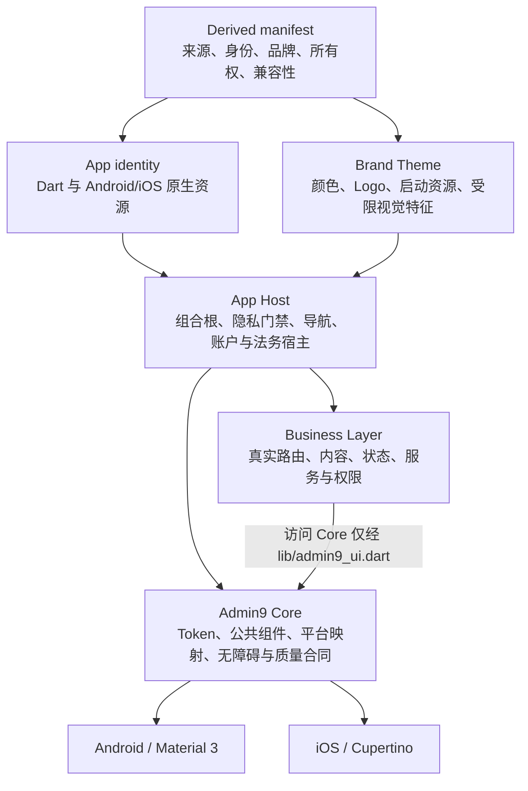

# Admin9 App Foundation

[English](../../README.md) | 简体中文

面向 Android/iOS Flutter 业务 App 的可派生工程基线：集中处理平台适配、无障碍、品牌身份、通用宿主和升级治理。它不是成品 App、后台模板、组件演示站或独立 UI package。

## 为什么采用

Foundation 处理的是多个业务 App 会重复承担、又不应散落到各 Feature 的工程责任：

- **受约束的平台适配**：公共 `App*` 组件在 Core 内完成 Material 3 与 Cupertino 映射；Business 不直接选择平台控件或编写平台分支。规则见[平台适配](../../docs/design-system/02-platform-adaptation.md)。
- **统一的无障碍状态合并**：系统字号与 App 字号相乘，高对比度、减少动态、Bold Text 和灰度遵循固定合并规则，并由布局矩阵、语义、对比度和设备证据门禁约束。规则见[无障碍与质量](../../docs/design-system/06-accessibility-quality.md)。
- **不伪造业务成功**：隐私门禁、一级导航、账户边界、设置和法务宿主已经成立；未接入真实服务时，认证和敏感操作只做本地校验并明确显示“服务尚未接入”，不会创建模拟用户、Token 或成功状态。
- **单一品牌与身份来源**：派生项目以根 `admin9-foundation.yaml` 驱动 Dart Brand、App identity、Android/iOS 标识和原生资源生成；校验器同时检查 schema、哈希、颜色对比度和 iOS 图标属性。合同见[派生项目合同](../../docs/design-system/05-derived-project-contract.md)。
- **机器化公共边界**：固定 barrel、导入规则、构造器 parity、Gallery、Golden、manifest、文档与 release consistency 都有仓库内门禁，不依赖人工记忆。
- **可追踪升级**：Design System、Foundation Git 来源、App 和客户业务分别版本化；派生项目记录精确 commit、兼容性 tuple、偏差、所有者和到期条件。
- **按真实复杂度扩展**：当前没有真实数据源，因此不创建 Repository、Service 或 Domain 空壳；这些边界只在 Business Feature 出现对应职责时引入。

## 适合与不适合

适合：

- 长期维护一个或多个 Android/iOS 品牌 App 的团队；
- 希望统一平台行为、无障碍、品牌生成和工程门禁的项目；
- 需要保留客户业务独立性，同时持续吸收 Foundation 通用修复的派生仓库。

不适合：

- Web、Desktop、后台管理端或跨端动态模块平台；
- 希望克隆后直接获得完整行业业务和后端能力的项目；
- 只想通过 pub.dev 引用一个 UI package 的项目；
- 需要 Foundation 预设客户数据模型、权限模型或远程页面 DSL 的项目。

本仓库是为多品牌派生而设计的工程基线；仓库内合同和工具证明了派生机制，但不等同于“已经在多个真实品牌项目中完成生产验证”。

## 治理与依赖边界

Core、Brand、Business 是三类所有权和变更治理边界，不是传统 UI/Data/Domain 运行时分层。App Host 负责组合它们，并提供启动、隐私门禁、导航、账户边界、设置与法务入口。



这张图描述的是**派生项目**。Foundation 源仓库刻意没有根 manifest。Business 访问 Core 只能通过 `lib/admin9_ui.dart`，但仍可使用本 feature、`lib/ui/shared/`，以及 App 白名单中的只读 `lib/app/app_identity.dart` 和 `lib/app/app_route_names.dart`。App Host 是组合宿主，不是第四类业务定制层。

完整规则见 [Design System 三类边界](../../docs/design-system/README.md#2-three-layer-model)、[ownership/import 合同](../../docs/design-system/05-derived-project-contract.md#2-ownership-and-imports)和[当前架构](../../docs/architecture/admin9-app-foundation.md)。

## 仓库包含什么

### App Host

- Flutter 启动、全局错误边界和 Provider 组合根；
- 首次启动隐私同意的 fail-closed 持久化门禁；
- “首页、我的”一级导航以及静态、可审计的二级路由；
- 游客/会话边界、设置、法务、关于和联系方式入口。

### Design System Core

- 语义 Token、主题和平台映射；
- 系统/App 外观与无障碍设置的合并规则；
- 公共 `App*` 组件、页面模式、交互反馈和调试/性能构建 Gallery；
- 固定公共 barrel、导入边界、构造器 parity、响应式矩阵和 Goldens。

公共组件清单和状态合同以[组件规范](../../docs/design-system/03-components.md)为准，根 README 不重复维护清单。

### 当前通用页面

当前提供首页、登录/注册/找回与修改密码入口、个人中心、资料、安全、注销、设置、用户协议、隐私政策、关于和联系方式页面。它们提供宿主结构、本地校验和真实的未接入状态，不提供后端、真实认证、客户内容或正式法律文本。

## 当前目录

```text
lib/
├── main.dart                 # Flutter 初始化与全局错误捕获
├── admin9_ui.dart            # Core 唯一公共 barrel
├── app/                      # App Host、路由、隐私门禁、身份与 Brand 入口
│   └── brand/                # manifest 生成的唯一 Brand Theme 数据入口
├── core/
│   ├── design_system/        # Core 实现、公共组件、平台映射与 Gallery
│   ├── errors/               # 全局错误边界
│   └── preferences/          # 外观、无障碍与隐私同意的本地偏好封装
└── ui/
    ├── features/             # feature-first Business 页面、状态与局部模型
    └── shared/               # 同一派生 App 内跨 feature 的 Business 共享 UI
```

不存在独立 lifecycle owner；当前 App Host 只在真实需要的位置观察系统无障碍特征变化。路由和 Brand 均归 `app/`，不属于 Core。

## 如何派生

派生项目必须从兼容性 registry 批准的精确 Foundation commit/Tag 开始；开源派生还必须确认所选源码实际包含根 `LICENSE`。随后将 canonical Foundation 配置为名为 `foundation` 的 fetch-only remote，并保持客户可写 remote 独立。然后复制有效 manifest fixture、填写真实身份和品牌资料、校验、生成 Dart/原生资源，最后在 `lib/ui/features/**` 接入业务。

仓库没有 manifest 初始化命令。可执行步骤、字段说明、生成影响面和验收命令见[派生 Quickstart](../../docs/derivation/quickstart.md)。规范性要求仍以[派生项目合同](../../docs/design-system/05-derived-project-contract.md)和[兼容性 registry](../../docs/design-system/schema/admin9-foundation-compatibility.json)为准。

## 如何证明没有漂移

Foundation 和派生项目使用同一组仓库内工具验证关键边界：

| 门禁 | 证明范围 |
| --- | --- |
| manifest validator | schema、精确兼容性 tuple、品牌哈希、对比度、偏差有效期 |
| Brand generator/verifier | Dart、pubspec、Android/iOS 身份与二进制资源来自同一 manifest |
| repository governance | canonical remote 和派生项目 fetch-only `foundation` remote |
| import boundaries | Core/App/Brand/Business ownership、公共 barrel 和平台分支边界 |
| public API parity | 声明与实现构造器一致，公共导出未漂移 |
| Gallery/Golden/tests | 公共组件状态、平台映射、布局、语义与视觉基线 |
| documentation/release consistency | 规则链接、版本、schema、fixture、compatibility 与 provenance 一致 |

Foundation 仓库的常用自动化检查：

```bash
flutter pub get
dart format --output=none --set-exit-if-changed lib test integration_test tool
flutter analyze
flutter test
dart run tool/design_system/validate_foundation_manifest.dart --fixtures
flutter analyze tool/design_system/design_system_contract_probe.dart
flutter analyze tool/design_system/design_system_implementation_probe.dart
dart run tool/design_system/verify_public_api_parity.dart --self-test
dart run tool/design_system/verify_import_boundaries.dart --fixtures
dart run tool/design_system/verify_import_boundaries.dart --phase=final
dart run tool/design_system/verify_gallery_boundary.dart
dart run tool/design_system/verify_brand_contract.dart
dart run tool/design_system/verify_brand_contract.dart --fixtures
dart run tool/design_system/verify_rule_links.dart
dart run tool/design_system/verify_repository_governance.dart
dart run tool/design_system/verify_android_release_plugins.dart --self-test
dart run tool/design_system/verify_android_release_plugins.dart
node tool/design_system/verify_documentation.mjs
flutter build apk --release
flutter build ios --release --no-codesign
git diff --check
```

版本发布还必须用目标版本和对应的 Foundation implementation commit 运行 `verify_design_system_release.dart`。该 provenance 命令不能在 README 中固定一个未来 commit；具体顺序见 [Design System 总览](../../docs/design-system/README.md#6-machine-contracts)。

## 版本与证据边界

| 概念 | 含义与当前边界 |
| --- | --- |
| Design System | 当前为 `v1.0.3`，表示规范、公共组件合同与质量门禁版本；以 `docs/design-system/README.md` 和不可移动的 `design-system-v*` Tag 为准 |
| Foundation source | compatibility registry 批准的精确实现 commit；不等同于 Tag 指向的 provenance commit |
| Foundation Tag | 指向单独 provenance commit 的已批准 Design System 发布入口；不得移动或重打既有 Tag |
| App version | `pubspec.yaml` 中当前为 `1.0.0+1`，不随 Design System 自动变化 |
| Toolchain | Flutter `3.44.1` / Dart `3.12.1` |
| 后端与会话 | 未接入真实后端；App 启动路径保持游客状态，不存在真实认证成功路径 |
| 设备证据 | v1.0.2 记录是绑定其来源和产物的历史证据；后续版本未重跑的实体机与辅助技术结果保持 `Unknown` |
| iOS 通用构建 | `flutter build ios --release --no-codesign` 只证明无签名构建，不证明签名、安装或冷启动 |

在新 Tag 实际创建并通过 compatibility/release consistency 门禁前，不把工作树中的版本准备描述成“已发布”。

既有 `design-system-v1.0.0` 至 `design-system-v1.0.3` Tag 不包含根 `LICENSE`，并继续保持不可移动、不可重打。采用者应选择 compatibility registry 批准且 checkout 实际包含 `LICENSE` 的来源。

## 文档入口

- [Design System 权威总览](../../docs/design-system/README.md)
- [派生项目合同](../../docs/design-system/05-derived-project-contract.md)
- [无障碍与质量](../../docs/design-system/06-accessibility-quality.md)
- [当前架构与 ownership](../../docs/architecture/admin9-app-foundation.md)
- [派生 Quickstart](../../docs/derivation/quickstart.md)
- [Changelog](../../docs/design-system/CHANGELOG.md)
- [贡献指南](../../CONTRIBUTING.md)
- [许可证](../../LICENSE)
