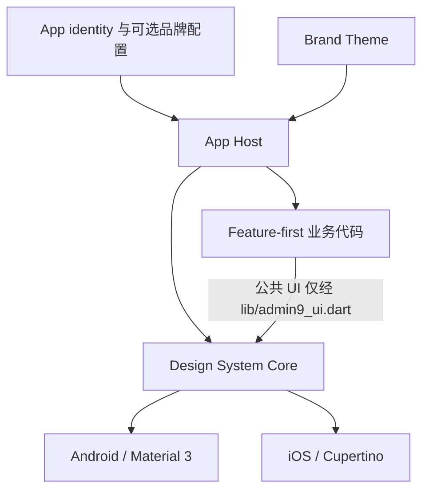

# Admin9 App Starter

[English](../../README.md) | 简体中文

Admin9 App Starter 是面向 Android/iOS 的开源 Flutter 起步工程，提供
feature-first 应用宿主、平台适配、无障碍行为、公共 Design System、质量门禁，
以及可选的身份与品牌配置工具。它不是完整业务产品、后台服务、管理端，也不是
任何其他项目的兼容性认证计划。

## 仓库包含什么

- Flutter 启动、全局错误处理、Provider 组合根和显式路由；
- 首次启动时 fail-closed 且可持久化的隐私同意门禁；
- 首页、个人中心、设置、法务内容宿主、关于和联系方式页面；
- 真实的游客态与“服务尚未接入”状态，不伪造用户、会话、Token、消息或后端成功；
- 通过公共 `App*` 组件完成 Material 3 与 Cupertino 映射；
- 外观与无障碍设置、响应式矩阵、Semantics、对比度、命中区、Gallery、Golden
  和平台质量检查；
- 用于同步身份、颜色、App 图标、启动图及 Android/iOS 原生显示信息的可选工具。

当前没有真实后端，也没有认证成功路径。只有当某个 Feature 出现真实数据源或
可复用业务规则时，才应在该 Feature 内引入 Repository、Service 或 Domain，
不预先创建空层。

## 架构



Core、Brand、Business 与 App Host 是本上游仓库的所有权和依赖边界，不是强制的
UI/Data/Domain 运行时分层。准备合入本上游仓库的修改遵循这些边界，以保持公共
代码可验证；fork 可以独立改变自己的架构。

```text
lib/
├── main.dart                 # Flutter 初始化与错误捕获
├── admin9_ui.dart            # Design System 公共 barrel
├── app/                      # App Host、路由、隐私门禁、identity、Brand
├── core/                     # Design System、错误处理和本地偏好
└── ui/
    ├── features/             # feature-first 页面、状态与局部模型
    └── shared/               # 本仓库内跨 feature 共享的 UI
```

当前上游实现规则见[架构说明](../architecture/admin9-app-starter.md)和
[Design System](../design-system/README.md)。

## Fork 与独立使用

你可以依据 [Apache License 2.0](../../LICENSE) 复制、修改、商用和再发布代码。
fork 完全独立：

- 本项目不认证、批准、登记、追踪或审计任何 fork；
- 不要求 manifest、compatibility registry、精确来源 commit 组合、指定 remote、
  禁用 push URL、ownership、deviation、expiry、provenance 或 clone acceptance；
- 本项目不承诺下游兼容、支持、迁移、安全维护、合规审查、交付或发布协助；
- fork 维护者自行负责维护、安全、隐私、法律合规、依赖审计、测试、签名、交付和
  用户支持；
- 通用修复没有必须回流上游的义务。只有贡献者主动选择时，才向上游提交贡献。

Apache 2.0 授予的是相应软件著作权和专利许可，不授予将产品表述为经 Admin9
背书、认证或“官方兼容”的权利，也不一般性授予将 Admin9 名称或 Logo 作为 fork
产品身份的权利，详见[商标说明](../../TRADEMARKS.md)。依赖、字体、图片和其他
第三方资源仍遵循各自许可证及声明，例如测试字体许可证保留在
`test/assets/fonts/OFL.txt`。

## 可选 App 与品牌配置

使用或 fork 本仓库不需要任何配置文件。可选的 JSON-compatible YAML schema 和
示例只用于减少重复的身份配置工作：

```bash
dart run tool/design_system/validate_app_config.dart --fixtures
dart run tool/design_system/validate_app_config.dart path/to/app-config.yaml
dart run tool/design_system/apply_app_config.dart path/to/app-config.yaml .
dart run tool/design_system/verify_app_config.dart path/to/app-config.yaml .
```

工具同步 App 名称和版本、Dart identity、`pubspec.yaml` 描述与资源、Android
namespace/application ID/显示名/Kotlin package/图标/启动图，以及 iOS bundle ID/
显示名/图标/启动图。修改 application ID 或 bundle ID 会影响安装覆盖、签名和升级，
必须由使用者主动选择；本次 Foundation 到 Starter 的上游改名不修改这些技术标识，
默认值继续为 `com.admin9.app.foundation`。

详见[可选定制 Quickstart](../customization/quickstart.md)。该工具只是便利能力，不是
兼容证明或批准机制。

## 上游验证

使用 Flutter 3.44.1 与 Dart 3.12.1，在仓库根执行：

```bash
flutter pub get
dart format --output=none --set-exit-if-changed lib test integration_test tool
flutter analyze
flutter test
dart run tool/design_system/validate_app_config.dart --fixtures
flutter analyze tool/design_system/design_system_contract_probe.dart
flutter analyze tool/design_system/design_system_implementation_probe.dart
dart run tool/design_system/verify_public_api_parity.dart --self-test
dart run tool/design_system/verify_import_boundaries.dart --fixtures
dart run tool/design_system/verify_import_boundaries.dart --phase=final
dart run tool/design_system/verify_gallery_boundary.dart
dart run tool/design_system/verify_app_config.dart
dart run tool/design_system/verify_app_config.dart --fixtures
dart run tool/design_system/verify_rule_links.dart
dart run tool/design_system/verify_upstream_ownership.dart
dart run tool/design_system/verify_android_release_plugins.dart --self-test
dart run tool/design_system/verify_android_release_plugins.dart
node tool/design_system/verify_documentation.mjs
flutter build apk --release
flutter build ios --release --no-codesign
git diff --check
```

iOS 无签名构建不证明签名、安装、冷启动或设备行为。真机与辅助技术结论必须绑定
实际测试的源码和产物。

## 版本与历史

- App 版本：`1.0.0+1`；
- 当前已记录的 Design System 发布版本：`1.0.3`；
- 工具链：Flutter `3.44.1` / Dart `3.12.1`；
- 既有 `design-system-v1.0.0` 至 `design-system-v1.0.3` Tag 及此前报告是不可变的
  历史记录，其中旧 Foundation 名称和下游治理措辞不再定义当前 Starter 项目；
- 新变更按 SemVer 管理，并先记录在 `Unreleased`；既有 Tag 不移动、不重打。

## 文档

- [Design System](../design-system/README.md)
- [无障碍与质量](../design-system/06-accessibility-quality.md)
- [当前架构](../architecture/admin9-app-starter.md)
- [可选定制 Quickstart](../customization/quickstart.md)
- [上游贡献边界](../design-system/05-upstream-contribution-boundaries.md)
- [验证](../audit/VALIDATION.md)
- [历史记录](../HISTORY.md)
- [Changelog](../design-system/CHANGELOG.md)
- [贡献指南](../../CONTRIBUTING.md)
- [商标说明](../../TRADEMARKS.md)
- [许可证](../../LICENSE)
